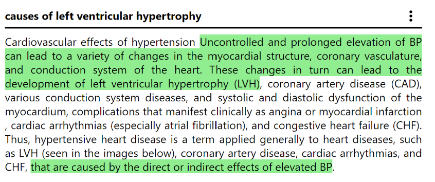
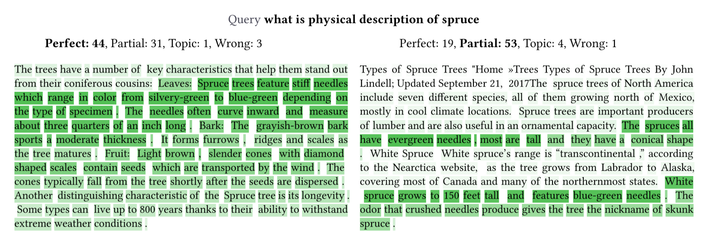
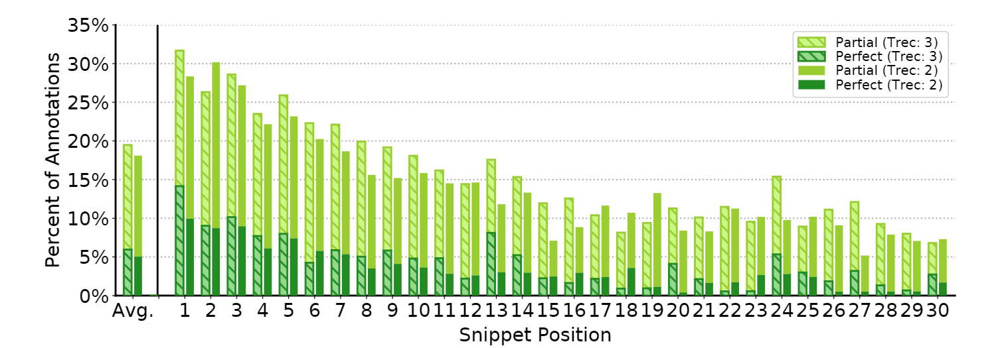

# FiRA: Fine-grained Relevance Annotations for TREC-DL'19

We present FiRA: a novel dataset of Fine-Grained Relevance Annotations. We extend the ranked retrieval annotations of the [Deep Learning Document Track of TREC 2019](https://github.com/microsoft/TREC-2019-Deep-Learning) with passage and word level graded relevance annotations for all relevant documents.
 
We split the documents into snippets and displayed query \& document snippet pairs to annotators. In the following Figure, we show an example of an annotated document-snippet. We ensure a high quality by employing at least 3-way majority voting for every candidate and continuous monitoring of quality parameters during our annotation campaign, such as the time spent per annotation. Furthermore, by requiring annotators to select relevant text spans, we reduce the probability of false-positive retrieval relevance labels.

Furthermore, we selected 10 pairs to be annotated by all our annotators, so that we can study their subjectivity with a dense distribution, as shown in the following Figure: 

*Comparison of two completely judged document snippets. The background heatmap for each word displays the number of times this word was part of a relevant region selection. The darker the green the more often annotators selected this word as being relevant.*

With FiRA annotations we can observe a distribution of relevance inside long documents. The following Figure shows, the bias towards earlier regions of the documents, however our results also highlight a significant amount of relevant snippets can be found later in the documents.

**Paper with more analysis coming soon**

## Usage Scenarios

The FiRA-TREC'19 dataset can be utilized for every approach concerned with long document ranking and the selection of snippets or answers from these documents.

## Dataset

The FiRA dataset contains **24,199** query \& document-snippet pairs of all **1,990** relevant documents for the **43** queries of TREC-DL. 

